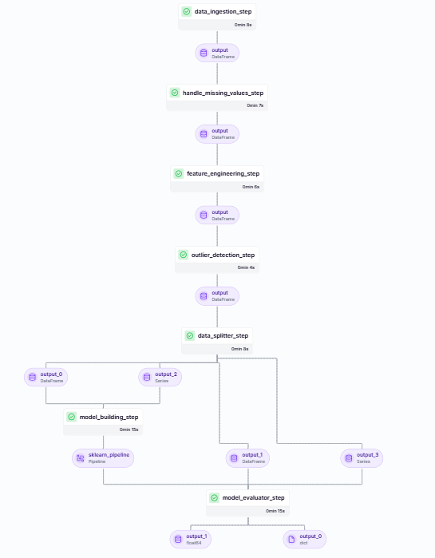
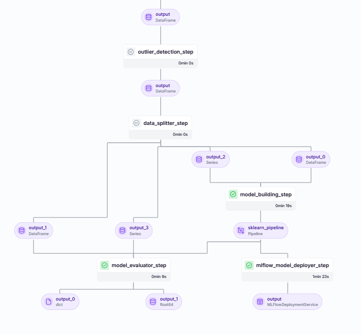

# __End-to-End Machine Learning Pipeline for Price Prediction using ZenML and MLflow__.
An end-to-end production grade machine learning pipeline for house price prediction using ZenML and MLflow.

## Table of Contents:
1. [Project Overview](#project-overview)
2. [Features](#features)
3. [Technologies Used](#technologies-used)
4. [Installation and Setting Up](#installation-and-setting-up)
5. [Design Pattern](#design-pattern)
6. [Pipeline](#pipeline)

## Project Overview
This project focuses on building an end-to-end machine learning pipeline for a house price prediction system. The pipeline is developed using __ZenML__, an __MLOps framework__ that helps in managing machine learning workflows, and MLflow, which is used for experiment tracking and model deployment. __The main goal of this project is to gain an understanding of MLOps, pipelining, OOP and MLflow.__

## Features:
- Automated data preprocessing and cleaning.
- Experiment tracking with MLflow.
- Deployment pipeline with ZenML.
- Model performance metrics visualization.
- Structured Data Processing.
- Made sure model is not only accuracte but also maintainable, scalable, and ready for real-world use.

## Technologies Used:
- **ZenML** - MLOps framework for managing ML workflows.
- **MLflow** - Tool for experiment tracking and model deployment.
- **Python** - Programming language.
- **Pandas, NumPy** - Libraries for data manipulation.
- **Scikit-learn** - For machine learning models.

## Installation and Setting Up:
1. Create virtual environment.
2. Create account in ZenML first. Then follow step 3. 
3. Run this script one by one:
    - `zenml integration install mlflow -y`
    - `zenml experiment-tracker register mlflow_tracker --flavor=mlflow`
    - `zenml model-deployer register mlflow --flavor=mlflow`
    - `zenml stack register local-mlflow-stack -a default -o default -d mlflow -e mlflow_tracker --set`
4. Run the pipeline.
    - `python run_pipeline.py`
5. For Deployment.
    - `python run_deployment.py`

## Design Pattern:
- Factory Design Pattern.
- Strategy Design Pattern.

## Pipeline:

__CI CD Pipeline__

